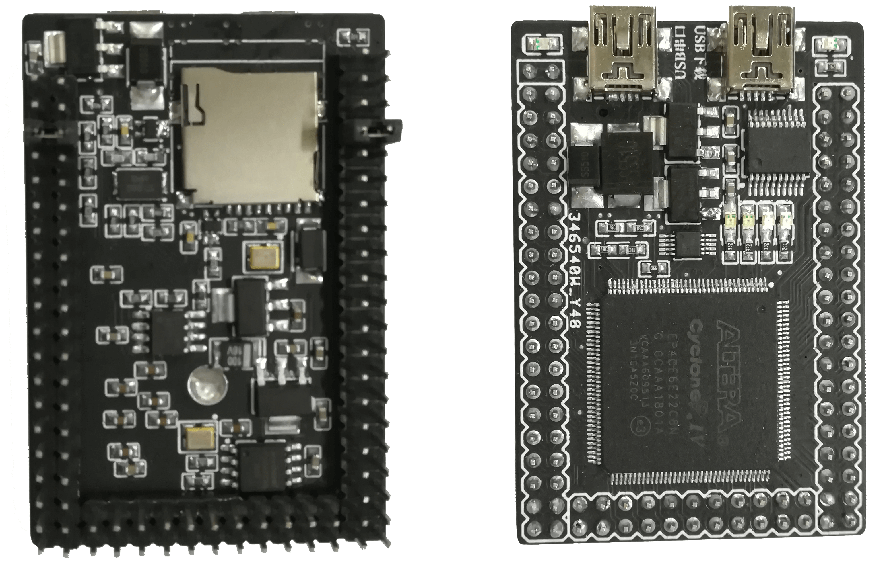
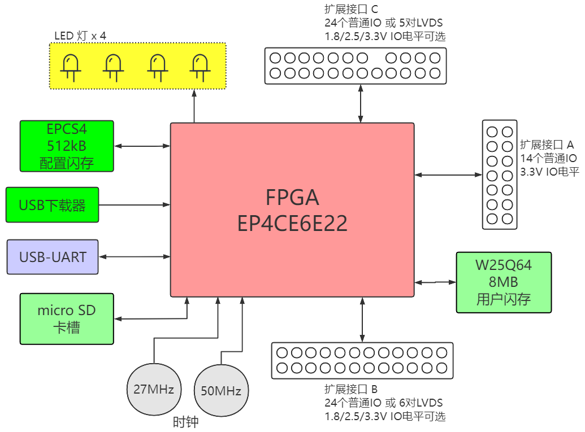

UniPlug-FPGA（EP4CE6版本）
===========================

体积小、低成本、易用、扩展性强的 FPGA 核心板

* FPGA型号：Altera Cyclone IV EP4CE6E22 （资源量为6kLUT）
* 集成 USB-Blaster （PIC18F14K50 单片机方案）
* USB-UART
* 512kB 配置闪存（EPCS4），用于存储 FPGA 配置
* 8MB 用户闪存（W25Q64）SPI-flash
* Micro-SD 卡槽
* 4个用户LED灯
* 三组扩展IO，IOA，IOB，IOC
  * IOA 为固定 3.3V 的 14 个普通 IO
  * IOB 可配置为 24 个普通 IO ，或 6 对 LVDS，电平可用跳线配置为 1.8V、2.5V 或 3.3V 
  * IOC 可配置为 24 个普通 IO ，或 5 对 LVDS，电平可用跳线配置为 1.8V、2.5V 或 3.3V 

**注：烧写 FPGA 时，需要按照《用户手册.pdf》把 IOB 和 IOC 的电源输入用跳线帽连接到任意电源上！否则 FPGA 将无法上传程序！**
