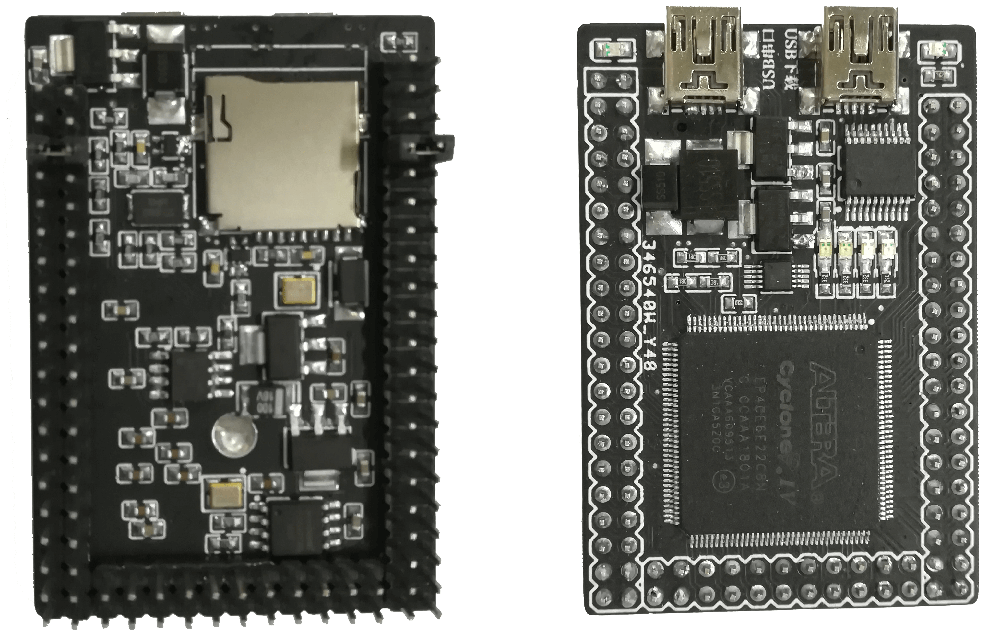
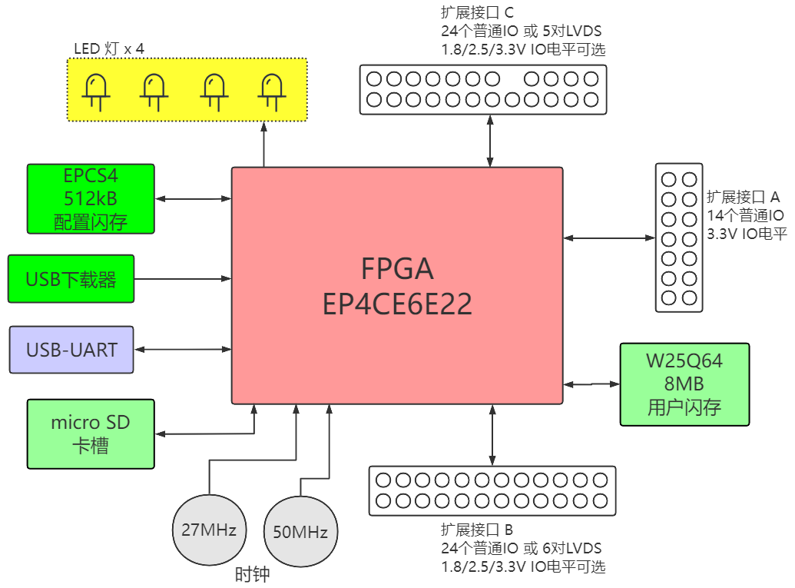
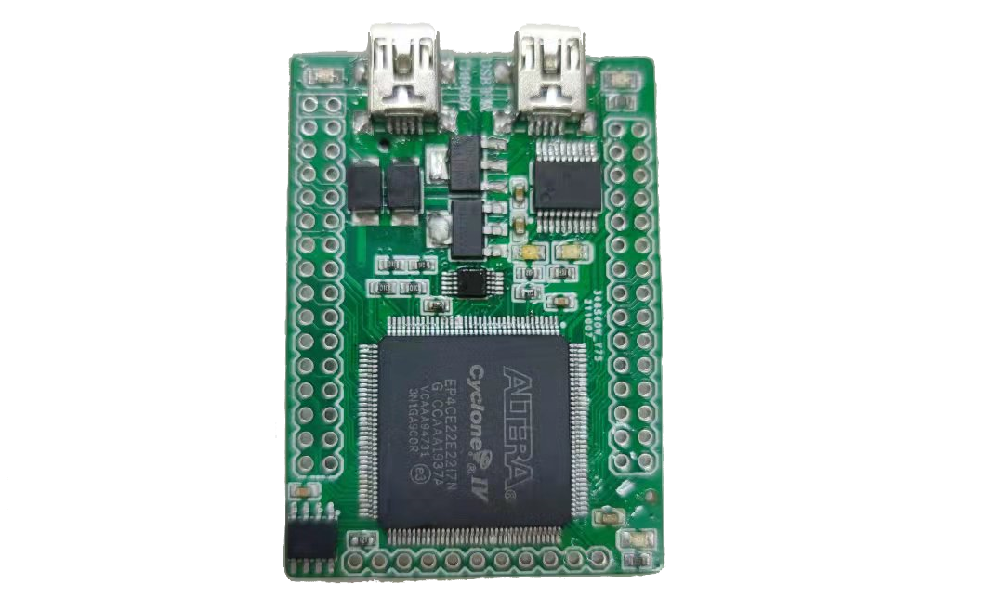
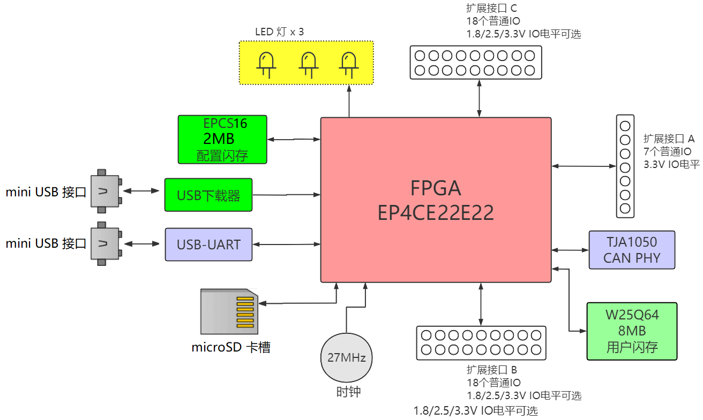

UniPlug-FPGA
===========================

体积小、低成本、易用、扩展性强的 FPGA 核心板，包含2个规格：

* EP4CE6 版本 (6k LUT, 276kbit BRAM)
* EP4CE22 版本 (22kLUT, 608kbit BRAM)

　

　

# EP4CE6 版本

|     |
| :--------------------------------: |
| 图：UniPlug-FPGA (EP4CE6版本) 成品 |

|       |
| :------------------------------------: |
| 图：UniPlug-FPGA (EP4CE6版本) 系统框图 |

UniPlug-FPGA (EP4CE6版本) 包含：

* FPGA: Altera Cyclone IV EP4CE6E22  (6k LUT, 276kbit BRAM)
* 集成 USB-Blaster (PIC18F14K50 单片机方案)
* 512kB 配置闪存 (EPCS4)，用于存储 FPGA 配置
* 8MB 用户闪存 SPI-flash (W25Q64) 
* USB-UART
* Micro-SD 卡槽
* 4个用户LED灯
* 三组扩展IO，IOA，IOB，IOC
  * IOA 是 14 个普通 IO ， 电平固定为 3.3V
  * IOB 可配置为 24 个普通 IO ，或 6 对 LVDS，电平可用跳线配置为 1.8V、2.5V 或 3.3V 
  * IOC 可配置为 24 个普通 IO ，或 5 对 LVDS，电平可用跳线配置为 1.8V、2.5V 或 3.3V 

### 制造注意事项

1. PCB用立创EDA设计，见： [oshwhub.com/wangxuan/ep4ce6-atom](https://oshwhub.com/wangxuan/ep4ce6-atom)
2. **FPGA芯片下方的散热焊盘必须焊接，否则FPGA无法上传程序**，我留了一个大通孔，方便焊接
3. 板上集成了 USB-blaster (Altera FPGA 烧录器)，需要给 PIC18F14K50 单片机烧写 USB-blaster 固件，见 [PIC18F14K50固件(USB-blaster)制作](./USB-Blaster-DIY.md)
4. 制造完成后，烧写 FPGA 时，**需要按照《用户手册.pdf》把 IOB 和 IOC 的电源输入用跳线帽连接到任意电源上！否则 FPGA 将无法上传程序！**
4. **EP4CE6/examples** 中提供了一个示例 Quartus 程序，用来测试板上的外设。

　

　

# EP4CE22 版本

|     |
| :---------------------------------: |
| 图：UniPlug-FPGA (EP4CE22版本) 成品 |

|       |
| :-------------------------------------: |
| 图：UniPlug-FPGA (EP4CE22版本) 系统框图 |

UniPlug-FPGA (EP4CE22版本) 包含：

* FPGA: Altera Cyclone IV EP4CE22E22 (22kLUT, 608kbit BRAM)
* 集成 USB-Blaster (PIC18F14K50 单片机方案)
* 2MB 配置闪存 (EPCS16)，用于存储 FPGA 配置
* 8MB 用户闪存 SPI-flash (W25Q64) 
* USB-UART
* CAN总线PHY (TJA1050)
* Micro-SD 卡槽
* 3个用户LED灯
* 三组扩展IO，IOA，IOB，IOC
  * IOA 是 7 个普通 IO ， 电平固定为 3.3V
  * IOB 可配置为 18 个普通 IO，电平可用跳线配置为 1.8V、2.5V 或 3.3V 
  * IOC 可配置为 18 个普通 IO，电平可用跳线配置为 1.8V、2.5V 或 3.3V 

### 制造注意事项

1. PCB用立创EDA设计，见： [oshwhub.com/wangxuan/ep4ce6-atom_copy](https://oshwhub.com/wangxuan/ep4ce6-atom_copy)
2. **FPGA芯片下方的散热焊盘必须焊接，否则FPGA无法上传程序**，我留了一个大通孔，方便焊接
3. 板上集成了 USB-blaster (Altera FPGA 烧录器)，需要给 PIC18F14K50 单片机烧写 USB-blaster 固件，见 [PIC18F14K50固件(USB-blaster)制作](./USB-Blaster-DIY.md)
4. 制造完成后，烧写 FPGA 时，**需要按照《用户手册.pdf》把 IOB 和 IOC 的电源输入用跳线帽连接到任意电源上！否则 FPGA 将无法上传程序！**
4. **EP4CE22/examples** 中提供了一个示例 Quartus 程序，用来测试板上的外设。
